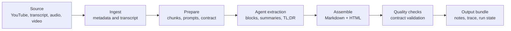

<h1 align="center">Notes Skill</h1>

<p align="center">
  A local-first <code>/notes</code> skill for turning YouTube videos, transcripts, audio, and video into structured study notes.
</p>

<p align="center">
  <a href="https://github.com/speech115/notes-skill/releases/latest"></a>
  <a href="https://github.com/speech115/notes-skill"></a>
  
  
</p>

---

Notes Skill is a reproducible notes pipeline for coding agents such as Codex. It ingests source material, prepares transcript chunks, gives agents precise extraction prompts, assembles Markdown/HTML notes, and records enough state to resume or debug a run later.

Use it when you want detailed study notes, not a short summary.

## Highlights

| Capability | What it gives you |
| --- | --- |
| YouTube notes | Uses available subtitles first, with advanced fallback transcription when configured. |
| Local media notes | Transcribes `.mp3`, `.m4a`, `.wav`, `.mp4`, `.mov`, `.mkv`, `.webm`, and more. |
| Transcript notes | Turns `.md` / `.txt` transcripts into structured notes with timestamps and sections. |
| Long-form coverage | Splits long lectures/interviews into agent-friendly chunks instead of compressing everything away. |
| Recoverable runs | Writes `run.json`, `timeline.jsonl`, `trace.jsonl`, and stage files for inspection and resume. |
| Optional delivery | Can send final HTML to Telegram when you explicitly configure a local delivery target. |

## Quick Start

Install from GitHub:

```bash
curl -fsSL https://raw.githubusercontent.com/speech115/notes-skill/main/install.sh | bash
```

Restart your agent client, then run:

```text
/notes https://www.youtube.com/watch?v=...
/notes /absolute/path/to/transcript.md
/notes /absolute/path/to/lecture.mp3
/notes /absolute/path/to/recording.mp4
```

The installer runs a smoke check and prints whether `notes-runner` is available on `PATH`.

## Requirements

**macOS**

```bash
brew install python pandoc yt-dlp ffmpeg
```

**Linux / WSL**

```bash
sudo apt install python3 pandoc ffmpeg
pip install yt-dlp
```

**Windows**

Install [WSL](https://learn.microsoft.com/en-us/windows/wsl/install), then follow the Linux instructions.

## How It Works



Each run produces a bundle with the final files and debugging state:

```text
run.json
timeline.jsonl
trace.jsonl
transcript.md
work/prepare_state.json
work/stages/*.json
конспект.md
конспект.html
```

## Supported Inputs

| Input | Starter setup | Extra setup |
| --- | --- | --- |
| YouTube URL with subtitles | Yes | None |
| Local `.md` / `.txt` transcript | Yes | None |
| Audio/video file | No | Groq API or MacWhisper Parakeet |
| Directory batch | Partial | Prepares per-file bundles and an index |
| Telegram voice/audio | No | Telegram MCP + transcription setup |

Batch mode prepares one bundle per supported file and writes `batch-index.json` / `batch-index.html`. Final per-item extraction, assembly, and delivery are separate unless those final artifacts already exist for each item.

## Audio Transcription

Pick one backend for audio/video files.

**Groq API: cross-platform and fast**

```bash
export GROQ_API_KEY=your-key-here
```

**MacWhisper Parakeet: local on macOS**

```bash
mw models select parakeet-pro:nvidia_parakeet-v3
```

When both are available, the runner can use Groq first and fall back to MacWhisper Parakeet on macOS if needed.

## Common Commands

```bash
notes-runner doctor
notes-runner doctor --json
notes-runner status "$WORK_DIR" --json
notes-runner batch /path/to/course --language en --prepare --json
```

Useful flags:

| Flag | Commands | Purpose |
| --- | --- | --- |
| `--title "Name"` | `audio`, `local` | Override the bundle title. |
| `--language en` | `audio`, `batch`, `youtube` | Set the transcription language hint. Default is `ru`. |
| `--transcribe-backend groq` | `audio`, `batch` | Force Groq transcription. |
| `--transcribe-backend parakeet` | `audio`, `batch` | Force MacWhisper Parakeet. |
| `--prepare` | all source commands | Run chunking and prompt preparation. |
| `--refresh` | all source commands | Re-ingest or re-transcribe instead of reusing cached state. |

## Local Development

This repository is the source of truth. The installed skill directory is a deployment target.

```bash
bin/status
python3 -m unittest discover -s tests -p 'test_*.py'
bash scripts/release-check.sh
```

For active local development, link the live skill once:

```bash
bash scripts/dev-link-live.sh
```

Before promoting a release:

```bash
git status --short
bash scripts/release-check.sh
bash scripts/promote-live.sh
```

`scripts/promote-live.sh --allow-dirty` is for forensic recovery, not the normal path.

See [RELEASE.md](RELEASE.md), [OBSERVABILITY.md](OBSERVABILITY.md), and [TROUBLESHOOTING.md](TROUBLESHOOTING.md).

## Telegram Delivery

Telegram delivery is opt-in. Copy `config.example.json` to your local `config.json`, set `"enabled": true`, and provide a chat target you control.

```json
{
  "telegram_delivery": {
    "enabled": true,
    "chat": "@your_channel_or_chat_id",
    "mcp_url": "http://127.0.0.1:8799/mcp",
    "parse_mode": "md"
  }
}
```

Keep `config.json` local-only. It may contain private delivery settings and should not be committed.

## Project Status

Current release: [v0.3.3](https://github.com/speech115/notes-skill/releases/tag/v0.3.3).

The release gate expects:

- `bin/status`
- unit tests
- `scripts/release-check.sh` with zero deterministic `SKIP`

If `release-check` in quick mode reports `SKIP`, treat it as a harness bug.
